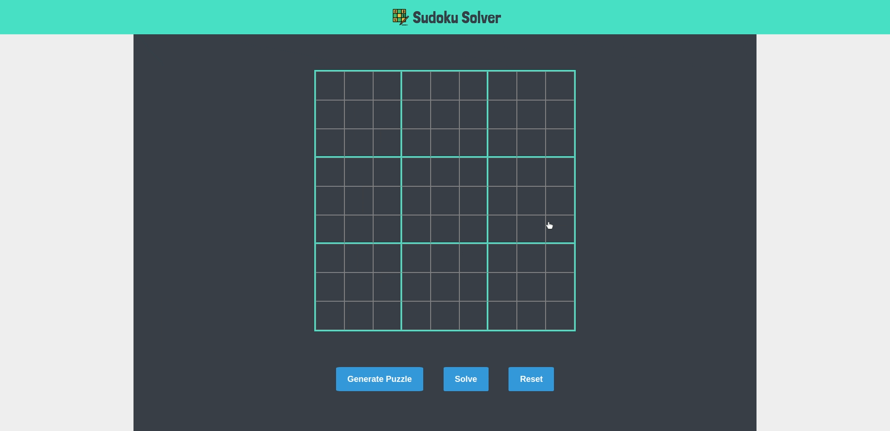

  <h1>Suduko Solver</h1>
  <h4 align="left">A web app built with React, Redux and Typescript that solves sudoku puzzles.</h4>
   

 

## Available Scripts

In the project directory, you can run:

### `yarn dev-server`

Runs the app in the development mode. 
Open [http://localhost:8080](http://localhost:8080) to view it in the browser.

### `yarn build`

Builds the app for production to the `build` folder. 
It correctly bundles React in production mode and optimizes the build for the best performance.

The build is minified and the filenames include the hashes. 
Your app is ready to be deployed!